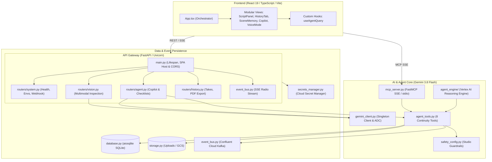

# 🎬 Architecture Overview — Flawless Take

> **Autonomous On-Set AI Continuity Supervisor**  
> Multimodal vision inspection, scene memory tracking, real-time crew alerts, and studio tool orchestration powered by Google Gemini.

---

## 1. System Architecture



---

## 2. Core Layers & Responsibilities

| Layer | Technology | Key Modules | Responsibility |
|---|---|---|---|
| **Presentation** | React 19, TypeScript, Vite | `src/components/`, `src/hooks/`, `App.tsx` | Responsive on-set UI, camera drops, copilot chat, voice mode, live alerts feed. |
| **API Gateway** | FastAPI, Starlette | `backend/main.py`, `backend/routers/` | Request validation, auth/secrets hydration, SPA static hosting, modular REST routing. |
| **Intelligence** | Google GenAI SDK | `backend/gemini_client.py`, `backend/agent_tools.py` | Multimodal visual diffing, script grounding, prompt injection defense, 8 continuity tools. |
| **Integration** | FastMCP, Dialogflow CX | `backend/mcp_server.py`, `backend/environments.py` | Model Context Protocol SSE endpoint for external agents; Agent Builder webhook fulfillment. |
| **Storage & Bus** | aiosqlite, Kafka | `backend/database.py`, `backend/storage.py`, `backend/event_bus.py` | Asynchronous take history, scene chronology, image preview assets, real-time crew radio alerts. |

---

## 3. The 8 Continuity Tools

All tools are implemented in `agent_tools.py` and shared across FastAPI, MCP, and Vertex AI:

1. `get_scene_continuity_state`: Aggregated take memory and drift status (`STABLE` / `DRIFTING` / `CRITICAL`).
2. `query_take_records`: Filterable search across past take inspection records.
3. `get_take_full_report`: Retrieve complete visual breakdown and metadata for a specific take ID.
4. `check_script_continuity`: Cross-reference actor appearance against uploaded shooting script notes.
5. `compare_recorded_takes`: Differential visual analysis comparing reference take vs. current take.
6. `emit_crew_alert`: Publish high-priority audio/visual alert to Confluent Kafka and SSE subscribers.
7. `export_continuity_pdf`: Generate official Hollywood-standard Daily Continuity Log PDF.
8. `generate_department_checklist`: Structured action checklist separated by Makeup, Wardrobe, Hair, and Props.

---

## 4. Serving Environments & Resilience

- **Development / Staging / Production**: Managed via `environments.py` with immutable version snapshots.
- **Graceful Fallbacks**:
  - *No Kafka credentials*: Automatically falls back to in-memory broadcast queues via Server-Sent Events.
  - *No Cloud Secret Manager*: Resolves environment variables from local `.env`.
  - *No Cloud Storage Bucket*: Stores frame captures in local `backend/uploads/` directory.

---

## 5. Repository Layout

```text
flawless-take/
├── backend/
│   ├── agent_engine/       # Vertex AI Agent Engine & Docker container
│   ├── routers/            # Modular FastAPI routers (system, vision, agent, history)
│   ├── gemini_client.py    # Singleton Google GenAI client & default model
│   ├── agent_tools.py      # Core 8 continuity supervisor tools
│   ├── database.py         # Async SQLite persistence (aiosqlite)
│   ├── event_bus.py        # Confluent Kafka producer + SSE broadcaster
│   ├── mcp_server.py       # Studio FastMCP SSE server
│   ├── safety_config.py    # Hollywood safety filters & prompt injection guardrails
│   ├── scene_memory.py     # Pure domain logic for scene memory and take verdicts
│   ├── storage.py          # Preview frames asset persistence
│   └── run_all_tests.py    # Master test runner (8 suites)
├── src/
│   ├── components/         # Modular React components (ScriptPanel, Copilot, Voice, etc.)
│   ├── hooks/              # Reusable React hooks (useAgentQuery)
│   ├── types.ts            # TypeScript domain interfaces
│   ├── config.ts           # API endpoint URL configuration
│   └── App.tsx             # Lightweight app container (~229 lines)
├── Dockerfile              # Multi-stage container (Node build -> Python 3.11)
├── docker-compose.yml      # Local containerized deployment
└── ARCHITECTURE.md         # This document
```

---

## 6. Verification & Health Commands

- **Run all backend tests**: `python backend/run_all_tests.py`
- **Lint and typecheck frontend**: `npm test`
- **Production frontend build**: `npm run build`
- **Container health check**: `GET /api/health` ➔ `{"status": "ok"}`
